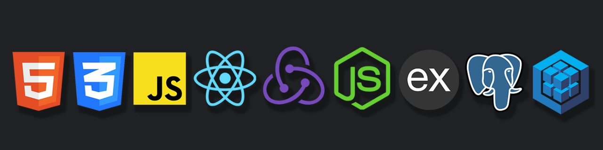

---

<h1 align="center"> Hola, soy Emmanuel, un gusto! 👋 :computer: </h1>

Actualmente me encuentro insertándome en el mundo de la programación, más precisamente en el desarrollo web como full stack, a punto de completar un bootcamp intensivo de +700 horas. Disfruto mucho el crear soluciones, sobretodo estudiando y aplicando las poderosas herramientas que nos da la tecnología, y me apasiona el poder hacerlo a través de aplicaciones web, entre otras.

---
## Proyectos

<a href="https://github.com/emmanueljuarezmil/PI-Countries-FT13" target="blank">Link del repo aquí</a>

Esta aplicación es un proyecto individual que fue creado durante mi bootcamp en <a href="https://www.soyhenry.com" target="_blank">Soy Henry</a>, siendo uno de los 2 proyectos requeridos.

En ella se puede ver información sobre todos los paises del mundo, de una forma dinámica, buscar entre los mismos por nombres, ordenarlos por población o nombre, y filtrarlos por continente o por actividad. Además se puede ingresar a algún país en particular para ver información más detallada.

Se pueden agregar actividades turisticas que se pueden realizar en los distintos paises, y linkearlas a uno o más paises, que serviran también para el filtro antes mencionado.

Las tecnologías utilizadas aqui son PostgreSQL, Sequelize, Express, React, Redux, y CSS puro, entre otras. Esta aplicación se sirve de la API <a href="https://restcountries.eu/" target="_blank">Rest Countries</a> para obtener información sobre todos los paises del mundo, y luego almacenarlos para trabajarlos y requerirlos desde la API propia.

---
## 🚀 Tech / soft skills: 
- React 
- Redux
- Express
- Sequelize
- PostgreSQL
- Javascript
- HTML5
- CSS3
- Sass
- Less
- Node.js
- Javascript
- GIT
- Scrum
- Creatividad
- Trabajo en equipo
- Autodidacta
- Hardware, software y multimedia

---
## 📫 CONTACTO

**Email:** emmanueljuarezmil@gmail.com
**LinkedIn:** <a href="https://www.linkedin.com/in/emmanueljuarezmil/" target="blank">https://www.linkedin.com/in/emmanueljuarezmil/</a>

---
